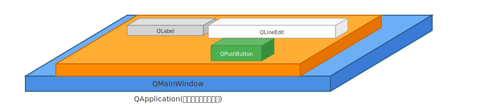

# PySide6の動作の仕組み

## QApplication と QWiget

PySide6アプリケーションは、**QApplication**と**QWidget**という2つのクラスのオブジェクトを積み上げて作ります。

| クラス | 説明 |
|--------|------|
| QApplication | アプリケーション全体を管理するクラス。イベントループの実行、システム設定の管理、全ウィジェットの統括を担当します。アプリケーション内で1つだけ生成して利用します。   |
| QWidget | すべてのUI要素の基底クラス。ウィンドウやボタン、ラベルなどのUIコンポーネントは全てQWidgetを継承しています。親子関係による階層構造を形成し、効率的なメモリ管理とイベント処理を実現します。 |

「QApplication の上に QWidget が乗っている。QWidget の上にもさらに QWidget が乗っている」というのが、PySide6のUIのイメージです。



上の図で、 QMainWindow, QLabel, QLineEdit, QPushButton はいずれも QWidget クラスのサブラクス(QWidgetクラスを継承したクラス)です。

***用語***

| 用語 | 意味 |
| ---- | ---- |
| コンテナオブジェクト | 別のオブジェクトを内部に有するオブジェクトのこと |

**コンテナオブジェクトの例：**  
エクセルであれば、エクセルファイルは複数のエクセルシートを持つ。エクセルシートは複数のセルを持つ。  
このとき、エクセルファイルはエクセルシートのコンテナオブジェクト。また、エクセルシートはセルのコンテナオブジェクト。

```python
import sys
from PySide6.QtWidgets import QApplication, QMainWindow, QWidget, QVBoxLayout, QPushButton, QLabel, QLineEdit

class MainWindow(QMainWindow):
    def __init__(self):
        super().__init__()
        self.setWindowTitle("PySide6 アーキテクチャ例")
        self.resize(400, 200)
        
        # 中央ウィジェットとレイアウトを設定
        central_widget = QWidget()
        self.setCentralWidget(central_widget)
        layout = QVBoxLayout(central_widget)
        
        # UI要素を作成（最上層の小さな要素たち）
        self.label = QLabel("これはQLabel")
        self.line_edit = QLineEdit("テキストを入力")
        self.button = QPushButton("クリック")
        
        # シグナルと関数を接続
        self.button.clicked.connect(self.my_function)
        
        # レイアウトに追加
        layout.addWidget(self.label)
        layout.addWidget(self.line_edit)
        layout.addWidget(self.button)
    
    def my_function(self):
        print("ボタンがクリックされました")


if __name__ == "__main__":
    # 1. QApplication を作成（最下層の青い土台）
    app = QApplication()
    
    # 2. QMainWindow を作成（オレンジの層）
    window = MainWindow()
    
    # 3. ウィンドウを表示してイベントループ開始
    window.show()
    app.exec()
```

## 「イベント」と「イベント処理の仕組み」

アプリケーション上で生じる様々な出来事のことを「イベント」と言います。

イベントの例:

- クリックした
- クリック状態が終わった
- ドラッグ開始した
- とあるウィジェットにフォーカスが来た
- とあるウィジェットからフォーカスが離れた
- とあるQLineEditの入力内容が変更された

QApplicationは、QWidgetの状態を常時監視しています。
たとえば、ウィンドウ上のボタンがクリックされたとします。そのときの処理の流れは以下のようになります。

1. QApplicationは、マウスクリックイベントを検知
2. QApplicationは、マウスクリックイベントが生じた座標を取得
3. QApplicationは、マウスクリックイベントが生じたところに QPushButton があったということを検知
4. QApplicationは、マウスクリックイベントを当該QPushButtonに送信
5. QPushButtonは、QApplicationから送信されたマウスクリックイベントを受信
6. QPushButtonは、あらかじめ関連づけられていた関数やメソッドを実行

## 基本構造

```
QApplication (アプリケーション全体を管理)
├── QWidget (トップレベル - 独立したウィンドウ)
│   ├── QWidget (子ウィジェット)
│   ├── QPushButton (子ウィジェット)
│   └── QLabel (子ウィジェット)
├── QWidget (別のトップレベルウィンドウ)
└── QDialog (ダイアログウィンドウ)
```

## まとめ - 2つの中核クラス

### QApplication
- **役割**: アプリケーション全体の管理者
- **責任**: イベントループ、システム設定、全ウィジェットの統括
- **特徴**: アプリケーション内で必ず1つだけ存在
- **管理対象**: すべてのQWidgetインスタンス

### QWidget
- **役割**: すべてのUI要素の基底クラス
- **特徴**: 親子関係による階層構造を形成
- **分類**:
  - **トップレベルウィジェット**: 親を持たない独立したウィンドウ
  - **子ウィジェット**: 他のウィジェット内に配置されるコンポーネント

## 親子関係の重要性

```python
# トップレベル（親なし）
main_window = QMainWindow()  # QApplication.topLevelWidgets()に含まれる

# 子ウィジェット（親あり）
button = QPushButton(main_window)  # main_windowの子
label = QLabel(main_window)        # main_windowの子
```

この階層構造により、Qtは効率的なメモリ管理、イベント処理、ウィジェットのライフサイクル管理を実現しています。
