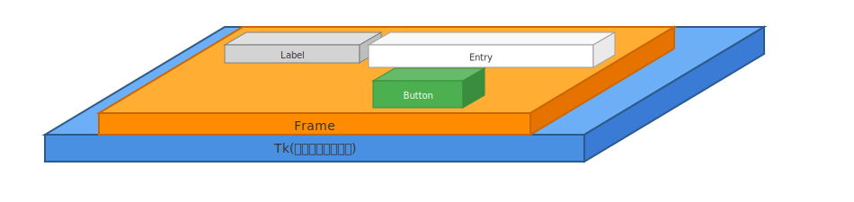

# Tk リファレンス

`tkinter` アプリケーションのルートウィンドウを管理する `Tk` クラスについての詳細なリファレンスです。

## 概要

`Tk` クラスは、`tkinter` アプリケーションのトップレベルウィンドウを作成するために使用されます。すべての `tkinter` ウィジェットは、このルートウィンドウまたはその子孫の中に配置される必要があります。



上の図で、 Frame, Label, Entry, Button はいずれも tkinter.Widget クラスのサブラクス(tkinter.Widgetクラスを継承したクラス)です。

***用語***

| 用語 | 意味 |
| ---- | ---- |
| コンテナオブジェクト | 別のオブジェクトを内部に有するオブジェクトのこと |

**コンテナオブジェクトの例：**  
エクセルであれば、エクセルファイルは複数のエクセルシートを持つ。エクセルシートは複数のセルを持つ。  
このとき、エクセルファイルはエクセルシートのコンテナオブジェクト。また、エクセルシートはセルのコンテナオブジェクト。


## 基本的な使用方法

### ウィンドウの作成と表示

```python
import tkinter as tk

# ルートウィンドウの作成
app = tk.Tk()

# ウィンドウのタイトルを設定
app.title("シンプルなウィンドウ")

# ウィンドウのサイズを設定 (幅x高さ)
app.geometry("300x200")

# イベントループを開始
app.mainloop()
```

### クラスベースでの作成

```python
import tkinter as tk

class SimpleApp(tk.Tk):
    def __init__(self):
        super().__init__()
        
        # ウィンドウの設定
        self.title("シンプルなウィンドウ（クラスベース）")
        self.geometry("300x200")

if __name__ == "__main__":
    app = SimpleApp()
    app.mainloop()
```

## 主要なメソッド

| メソッド | 説明 |
| --- | --- |
| `title(string)` | ウィンドウのタイトルバーに表示されるテキストを設定します。 |
| `geometry(geometry_string)` | ウィンドウのサイズと位置を設定します。例: `"300x200+100+100"` (幅300, 高さ200, x座標100, y座標100) |
| `minsize(width, height)` | ウィンドウの最小サイズを指定します。 |
| `maxsize(width, height)` | ウィンドウの最大サイズを指定します。 |
| `resizable(width, height)` | ウィンドウのサイズ変更の可否をブール値で設定します (水平方向、垂直方向)。 |
| `mainloop()` | アプリケーションのイベントループを開始します。ユーザーの操作を待ち受け、ウィンドウが表示され続けるようにします。 |
| `destroy()` | ウィンドウを破棄し、`mainloop` を終了します。 |
| `update()` | ウィンドウの表示を強制的に更新します。 |

## 実用的な例

### ウィンドウ位置の指定

`geometry` メソッドに `"幅x高さ+X座標+Y座標"` の形式で文字列を渡すことで、ウィンドウのサイズと表示位置を同時に指定できます。

```python
import tkinter as tk

app = tk.Tk()
app.title("位置指定ウィンドウ")

# 幅 400, 高さ 300, 画面の (100, 200) の位置に表示
app.geometry("400x300+100+200")

app.mainloop()
```

### ウィンドウの中央表示

```python
import tkinter as tk

app = tk.Tk()
app.title("中央表示ウィンドウ")

window_width = 400
window_height = 300

# 画面の解像度を取得
screen_width = app.winfo_screenwidth()
screen_height = app.winfo_screenheight()

# 中央に表示するための座標を計算
center_x = int(screen_width/2 - window_width / 2)
center_y = int(screen_height/2 - window_height / 2)

app.geometry(f'{window_width}x{window_height}+{center_x}+{center_y}')

app.mainloop()
```

### ウィンドウ終了の確認

```python
import tkinter as tk
from tkinter import messagebox

def on_closing():
    if messagebox.askokcancel("終了", "本当に終了しますか？"):
        app.destroy()

app = tk.Tk()
app.title("終了確認")

# ウィンドウの閉じるボタンにカスタム関数をバインド
app.protocol("WM_DELETE_WINDOW", on_closing)

app.mainloop()
```

### クラスベースでの実装

小規模なスクリプトでは手続き的な書き方でも問題ありませんが、より複雑なアプリケーションでは、コードをクラスにまとめることで、構造化され、再利用しやすくなります。

`tk.Tk` や `tk.Frame` を継承してカスタムアプリケーションクラスを作成するのが一般的です。

- **`tk.Tk` を継承するケース**: アプリケーションの主となるウィンドウ（ルートウィンドウ）そのものをクラスとして定義する場合に適しています。シンプルで単一ウィンドウのアプリケーションに多く使われます。この場合、クラスのインスタンスがルートウィンドウ自身となります。

- **`tk.Frame` を継承するケース**: より複雑なUIで、ウィンドウの特定の部分（例えば、ツールバー、ステータスバー、メインコンテンツ領域など）を部品としてカプセル化したい場合に適しています。この方法では、まず `tk.Tk()` でルートウィンドウを作成し、その中に `tk.Frame` を継承したカスタムウィジェットのインスタンスを配置します。これにより、UI部品の再利用性が高まります。

以下は、主ウィンドウとして `tk.Tk` を継承する一般的な例です。

```python
import tkinter as tk
from tkinter import messagebox

class App(tk.Tk):
    def __init__(self):
        super().__init__()

        self.title("クラスベースのアプリ")
        self.geometry("400x300")

        self.create_widgets()
        
        # ウィンドウの閉じるボタンの挙動を設定
        self.protocol("WM_DELETE_WINDOW", self.on_closing)

    def create_widgets(self):
        # ラベルの作成
        self.label = tk.Label(self, text="これはクラスベースのtkinterアプリケーションです。")
        self.label.pack(pady=20)

        # ボタンの作成
        self.greet_button = tk.Button(self, text="挨拶", command=self.say_hello)
        self.greet_button.pack()
        
        # 終了ボタン
        self.quit_button = tk.Button(self, text="終了", command=self.on_closing)
        self.quit_button.pack(pady=10)

    def say_hello(self):
        messagebox.showinfo("挨拶", "こんにちは！")
        
    def on_closing(self):
        if messagebox.askokcancel("終了確認", "本当にアプリケーションを終了しますか？"):
            self.destroy()

if __name__ == "__main__":
    app = App()
    app.mainloop()
```

## ベストプラクティス

| プラクティス | 説明 |
| --- | --- |
| **インスタンス化** | `Tk` のインスタンスは、アプリケーション全体で一つだけ作成するのが基本です。 |
| **ウィジェットの配置** | `Tk` インスタンスを作成した後、他のウィジェットを作成して配置します。 |
| **`mainloop` の呼び出し** | `mainloop()` は、すべてのウィジェットの作成と設定が終わった後、スクリプトの最後に呼び出します。 |
| **クラスベースの実装** | 中規模以上のアプリケーションでは、コードの再利用性とメンテナンス性を高めるために、`tk.Tk` や `tk.Frame` を継承したクラスとして実装することが推奨されます。 |

## 参考リンク

- [Python Docs - tkinter — Python interface to Tcl/Tk](https://docs.python.org/3/library/tkinter.html)
- [TkDocs Tutorial](https://tkdocs.com/tutorial/index.html) 